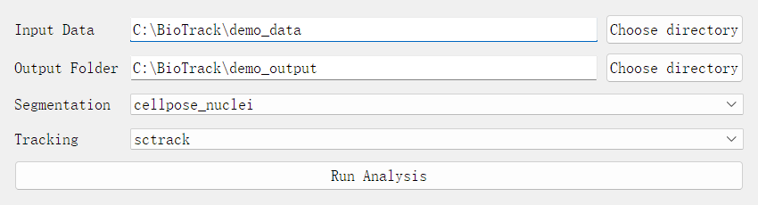
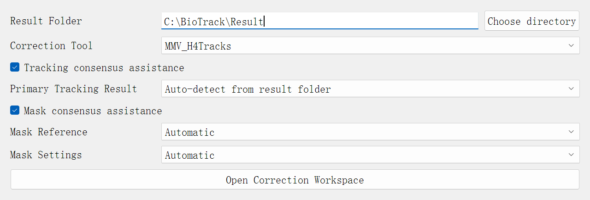
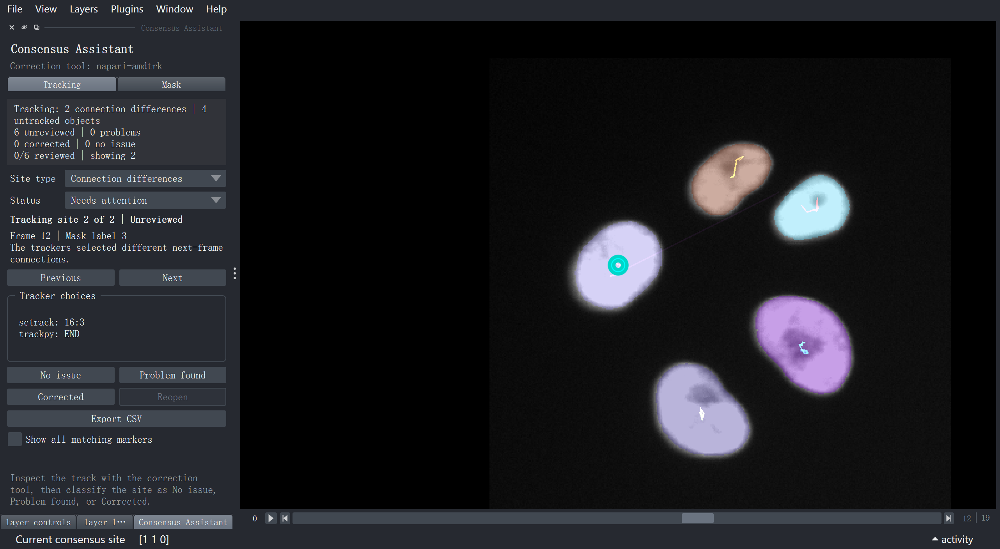
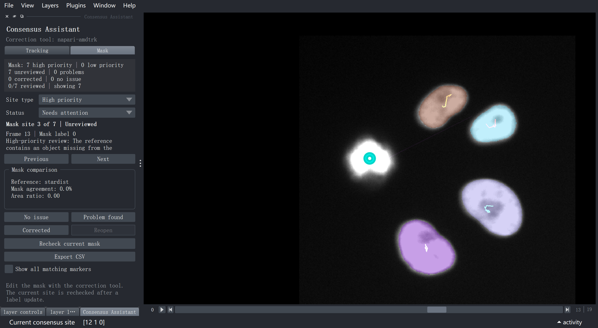
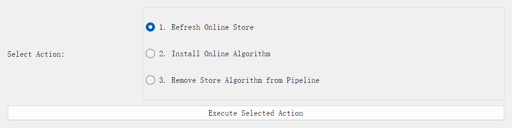

# BioTrack Studio User Protocol

**For:** wet-laboratory researchers and imaging scientists.

**Use this protocol** to install BioTrack Studio, run one complete analysis,
review consensus markers, save corrections, and export a review report. The
illustrated PDF is the main document for non-programmers.

**Use the notebook** `BioTrack_Studio_Demo.ipynb` only when you need the full
reference: all method choices, input rules, consensus parameters, server notes,
CSV columns, scientific limitations, and publication records. No notebook cell
must be executed to use the software.

> Consensus means that two algorithms are compared. A marker shows where they
> disagree; it does not prove that either result is wrong. Always decide from
> the raw image and biological context.

## 1. Prepare the Images

Choose one folder containing a single-channel 2D time series. It may contain:

- one TIFF file per time point; or
- one multi-page TIFF whose pages are consecutive time points.

For separate files, make sure the filenames sort in time order. Names such as
`t000.tif`, `t001.tif`, and `t002.tif` are recommended. All frames must have the
same width, height, and data type. Do not mix unrelated TIFF files in the input
folder.

Create a new empty output folder for each analysis. Keep the original images in
a separate location.

### Included demo

Run the included `demo_data` before using experimental data. It contains 20
consecutive frames of real HeLa cells expressing H2B-mCherry. The sequence was
cropped uniformly from a CC BY 4.0 dataset by Romain Guiet; full attribution and
processing details are in `demo_data/DATA_SOURCE.txt`.

The demo checks installation and shows how consensus works. It is not ground
truth and is not an accuracy benchmark.

## 2. Install and Open

Extract the complete release ZIP first. Do not run a launcher from inside the
ZIP archive.

### Windows

1. On the first use, double-click `setup_conda.bat` and wait for it to finish.
2. Double-click `winstart.bat`.
3. For later sessions, use `winstart.bat` directly.

### macOS

1. Open Terminal.
2. Type `cd` followed by one space. Do not press Return yet.
3. Drag the extracted `BioTrack_Studio` folder from Finder into Terminal.
4. Press Return.
5. On the first use, run:

```bash
bash setup_conda.sh
```

6. Start BioTrack Studio with:

```bash
bash start.sh
```

For later sessions, return to the folder and run only `bash start.sh`.

### Linux

Open a terminal in the extracted folder and run:

```bash
bash setup_conda.sh
bash start.sh
```

For a remote Linux server, napari needs a graphical display. Connect with X11
forwarding before launching. MobaXterm can provide the display when
**X11-Forwarding** is enabled in the SSH session.

The first setup may take tens of minutes because several isolated environments
are created. Keep the launcher open. If setup is interrupted, start the same
launcher again; completed steps are reused.

## 3. Run the Demo Pipeline

In napari, open **Plugins > BioTrack Studio > Cell Analysis Pipeline**.



1. For **Input Data**, select the included `demo_data` folder.
2. For **Output Folder**, select a new empty folder.
3. Select `cellpose_nuclei` for **Segmentation**.
4. Select `sctrack` for **Tracking**.
5. Select **Run Analysis** and wait until the result opens in napari.
6. Move through the first, middle, and final frames.
7. Confirm that colored masks follow the visible nuclei and tracks extend over
   several frames.

A complete run creates:

| File | Meaning |
| --- | --- |
| `image.tif` | Image sequence used by the pipeline |
| `mask.tif` | Labelled segmentation for every frame |
| `track.csv` | Track identity, frame, state, mask label, and position |
| `config.yaml` | File and column mapping for correction tools |

The default cell state is `none` unless a tracker supplies another state.

## 4. Analyze Your Own Data

Use the same Pipeline panel and select the method for the object visible in your
images.

| Segmentation | Intended starting point |
| --- | --- |
| Cellpose Cyto | Whole cells or cytoplasm-like objects |
| Cellpose Nuclei | Fluorescent nuclei |
| StarDist | Round or star-convex fluorescent nuclei |

| Tracking | Intended starting point |
| --- | --- |
| SC-Track | Longer sequences and lineage-aware tracking |
| TrackPy | Clearly separated objects |
| Ultrack | Crowded or ambiguous scenes |

SC-Track requires at least 13 frames. No model works best for every specimen.
Inspect the mask before interpreting tracks. Do not compare a whole-cell mask
with a nuclear mask as though they represented the same object.

## 5. Open Manual Correction

Open **Plugins > BioTrack Studio > Manual Correction**.



1. Select the complete result folder.
2. Select **napari-amdtrk** or **MMV_H4Tracks**.
3. Leave both consensus boxes clear for ordinary correction, or enable one or
   both boxes for consensus assistance.
4. Select **Open Correction Workspace**.

Use **napari-amdtrk** when the corrected result must remain in BioTrack Studio's
standard `mask.tif` and `track.csv` format. Its **Save** button updates those
files. MMV_H4Tracks provides its own tab-based tools and saves directly loaded
BioTrack layers to a separate Zarr file; it does not replace the standard TIFF
and CSV files.

**Official correction tutorials:** [napari-amdtrk guide](https://github.com/Jeff-Gui/napari-amdtrk-plugin),
[napari-amdtrk video](https://drive.google.com/file/d/1oHPdYcKv-QgOWylm21DnOF1NlVNsRIcL/view),
and [MMV_H4Tracks guide](https://github.com/MMV-Lab/mmv_h4tracks). BioTrack
Studio installs and opens both tools automatically, so do not repeat the
installation or file-loading steps shown there. The external pages may show a
newer interface; follow this guide for opening files, consensus assistance, and
saving BioTrack results.

## 6. Use Consensus Assistance

For the included demo:

1. Select its completed result folder.
2. Select **napari-amdtrk**.
3. Enable **Tracking consensus assistance**.
4. Enable **Mask consensus assistance**.
5. Keep the primary tracker, mask reference, and mask settings on **Automatic**.
6. Select **Open Correction Workspace** and wait while the comparison runs.

The original result remains unchanged. BioTrack Studio creates a dated copy in:

```text
consensus_assist/runs/<date_time>/correction
```

The tested Windows reference run produced six tracking review sites: two
connection differences and four segmented objects missing from the SC-Track
table. Small numerical differences are possible across computers.



The Tracking tab shows the current frame, mask label, and the next-frame choice
made by SC-Track and TrackPy. Start with **Connection differences**, then inspect
**Untracked objects**. The cyan ring marks the current site.

The same reference run produced seven high-priority mask sites and no
low-priority sites. All seven were visible nuclei present in StarDist but absent
from the Cellpose Nuclei mask. Several are the same biological cell at different
frames, so these are seven frame-level review sites, not seven unique cells.



The Mask tab compares Cellpose Nuclei with StarDist. **High priority** means a
strong model disagreement; it still requires human review. The reference mask
is not ground truth.

## 7. Review, Correct, and Save

For each marker:

1. Inspect the raw image, mask, and local track.
2. Use **Previous** and **Next** to move through the filtered queue.
3. Choose one classification:

| Button | Meaning |
| --- | --- |
| **No issue** | The primary result is acceptable |
| **Problem found** | A real problem exists but is not corrected yet |
| **Corrected** | The edit was completed and saved |
| **Reopen** | Return a previous decision to the review queue |

For a real problem, use this order:

1. Select **Problem found**.
2. Correct the mask or track with the correction tool.
3. Select **Save** in napari-amdtrk.
4. Return to the Consensus Assistant and select **Corrected**.

Selecting **Corrected** records the review decision; it does not edit or save a
mask by itself. After editing a mask, **Recheck current mask** tests whether the
local disagreement remains in the open napari layer.

## 8. Export the Review Report

Select **Export CSV**. The assisted correction folder contains:

| File | Use |
| --- | --- |
| `consensus_review_status.csv` | Saves classifications when the review is reopened |
| `consensus_review_report.csv` | One row for every review site |
| `consensus_review_summary.csv` | Overall, Tracking, and Mask totals |

These files open directly in Excel. Report initial sites, confirmed problems,
corrected problems, accepted sites, and sites still needing attention as
separate values. A decrease in open markers is review progress, not an accuracy
score.

## 9. Finish and Check

Before closing the correction window, confirm that:

- early, middle, and final frames display correctly;
- corrections were saved in the intended format;
- the review CSV files were exported;
- the original Pipeline result was kept; and
- the selected algorithms and any custom settings were recorded.

For complete input rules, skip modes, custom mask-consensus parameters, CSV
columns, server instructions, publication records, and scientific limitations,
open `BioTrack_Studio_Demo.ipynb` in the `docs` folder.

## 10. Add a Tested Algorithm

The optional Algorithm Store installs additional methods that have been adapted
and tested for BioTrack Studio. It is not required for Cellpose, StarDist,
SC-Track, TrackPy, or Ultrack.

Open **Plugins > BioTrack Studio > Algorithm Store**.



1. Select **Refresh Online Store**, then select **Execute Selected Action**.
2. Select **Install Online Algorithm**.
3. Choose an available algorithm. An empty list means that no additional
   validated method is currently published.
4. Select **Execute Selected Action** and keep napari open while the isolated
   environment is installed.
5. Wait for the successful-installation message.
6. Close and reopen **Cell Analysis Pipeline**. The new method will appear in
   the appropriate Segmentation or Tracking list.
7. Run the included demo or the test data supplied with the adapter before
   analyzing experimental data.

To hide a Store-installed method, choose **Remove Store Algorithm from
Pipeline**. This removes its menu registration but deliberately keeps the conda
environment and downloaded files so that a failed or accidental removal does
not destroy the installation. It therefore does not free disk space. Included
BioTrack Studio methods cannot be removed or replaced through the Store.

The Store does not make arbitrary GitHub code compatible. Every listed method
must provide a BioTrack Studio adapter that accepts the standard inputs and
writes `mask.tif` or `track.csv`. Treat a newly installed algorithm as a new
scientific method: check its license and citation, record its version and
settings, and validate its output for the specimen being studied.

## Help, License, and Citation

If the demo fails, retry the same launcher once. If it still fails, keep the
installation log and report the operating system, selected action, last visible
message, and whether napari opened. Do not upload private microscopy data or
credentials.

BioTrack Studio is research software and is not intended for clinical
diagnosis. It is distributed under GNU GPL version 3. Integrated tools and demo
data retain their own licenses. See `LICENSE`, `THIRD_PARTY_NOTICES.md`,
`ACKNOWLEDGEMENTS.md`, and `demo_data/DATA_SOURCE.txt`. Cite the original
segmentation, tracking, correction, and dataset publications used in an
analysis.
